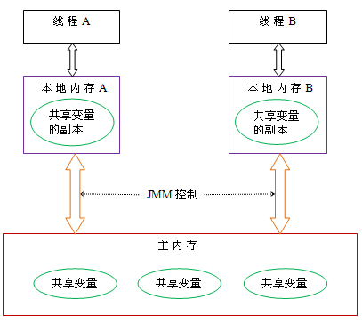

# 内存模型

## 什么是内存模型

多处理器系统中，处理器都会有多级缓存，就像前面说的这些高速缓存离处理器更近并且可以存储一部分数据，所以高速缓存可以改善处理器获取数据的速度和减少对共享内存数据总线的占用。虽然缓存能极大的提高性能，但是同时也带来了挑战。比如：当两个处理器同时操作同一个内存地址的时候，该如何处理？这两个处理器在什么条件下才能看到相同的值？

而内存模型就是：
**定义一些充分必要的规范，这些规范使得其他处理器对内存的写操作对当前处理器可见，或者当前处理器的写操作对其他处理器可见。**

实现可见性要求：
**其他处理器对内存的写一定发生在当前处理器对同一内存的读之前，称之为其他处理器对内存的写对当前处理器可见。**

## Java内存模型

Java内存模型检查JMM，而JMM指的就是一套规范，现在最新的规范为JSR-133**，此规范包括：

1.  **线程之间如何通过内存通信**；
2.  **线程之间通过什么方式通信才合法，才能得到期望的结果**。

并发编程模型的两个关键问题：线程之间如何`通信`及线程之间如何`同步`。通信指线程之间以何种方式来交换信息。命令编程模式下主要有两种通信机制：`共享内存`和`消息传递`。同步是指程序中用于控制不同线程间操作发生相对顺序机制。而Java并发采用的是`共享内存模型`。

### Java内存模型的抽象结构

Java 内存模型将内存分为`共享内存`和`本地内存`。共享内存又称为堆内存，指的就是线程之间共享的内存，包含所有的实例域、静态域和数组元素。每个线程都有一个私有的，只对自己可见的内存，称之为本地内存。

- 对内存在线程间共享。
- 局部变量、方法参数、异常处理参数不会被线程共享，不受内存模型的影响。

java线程之间的通信方式有JMM控制，JMM决定一个线程对共享变量的写入何时对另一个线程可见。JMM定义了线程和主内存之间的抽象关系。线程间的共享变量都存储在主内存中，而每个线程都有一个私有的本地内存，本地内存存储了该线程以读/写共享变量的副本，JMM规定线程不能直接在主内存修改共享变量。Java的内存模型抽象示意图如下：

    public class DemoThread{
       int i = 0;

       //Thread A
       public void write(){
         i = 1;
       }

       //Thread B
       public int read(){
         return i;
       }

    }

一个线程间通信的过程需要经历两个步骤:
1. 线程A把本地内存中修改的共享变量i刷新到主内存中去。按顺序细分为下面三个步骤：
 - 读取主内存中的i，保存i的副本到本地内存中
 - 修改本地内存中i的值
 - 把i的值刷新到主内存中去
2. 线程B到主内存中去读取线程A之间更新过的共享变量。

JMM通过控制主内存与每个线程的本地内存之间的交互，来为Java程序员提供内存可见性的保证。
